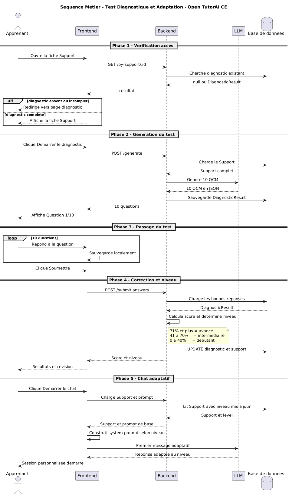
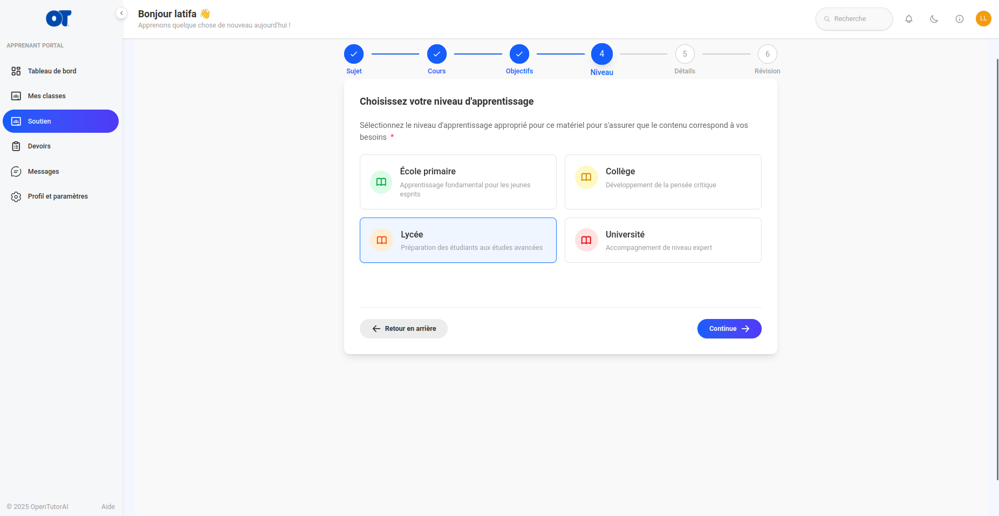

# Adaptive Diagnostic Test

> Contribution to **Open TutorAI CE** — LLM-based level assessment before each pedagogical chat session.

---

## Table of Contents

1. [Overview](#overview)
2. [Architecture and Flow](#architecture-and-flow)
3. [File Structure](#file-structure)
4. [API Documentation](#api-documentation)
5. [Setup and Usage](#setup-and-usage)
6. [Tests](#tests)
7. [Data Model](#data-model)

---

## Overview

The **Adaptive Diagnostic Test** is a mandatory module that sits between accessing a
learning support and starting the pedagogical chat. It generates 10 personalized
questions via an LLM from the full support content (title, description, objective,
keywords, type, files), assesses the learner's level, and adapts the AI tutor's
behavior accordingly.

### Why this module?

Without prior assessment, the AI tutor does not know the learner's level and produces
unsuitable responses. This module solves this by establishing a level profile at the
first interaction with a support.

### Level Profiles

| Score | Assigned Profile | Chat Behavior |
|---|---|---|
| 0 – 40% | Beginner | Simplified explanations, one concept at a time, concrete examples, no jargon |
| 41 – 70% | Intermediate | Balanced content, progressive deepening, nuances and exceptions |
| 71 – 100% | Advanced | Technical content, complex cases, specialized references, fast pace |

### Access Constraint

The student **cannot access the chat** until the diagnostic test is completed.
If the student accesses the support page without having completed the test, they are
automatically redirected to the test page.

---

## Architecture and Flow

### Main Flow

```
Student accesses support
         │
         ▼
[SupportDetails.svelte]
  Checks if test is already completed
  via GET /api/v1/diagnostics/by-support/{support_id}
         │
    ┌────┴────┐
    │         │
Completed   Not completed / absent
    │         │
    ▼         ▼
  Chat    Automatic redirect
         to /student/support/{id}/diagnostic
                   │
                   ▼
         [DiagnosticTest.svelte]
           Student clicks "Start Diagnostic"
           POST /api/v1/diagnostics/generate
           → LLM generates 10 targeted questions
             from title, description, objective,
             keywords, type, declared level and support files
                   │
                   ▼
           Quiz display (10 MCQ questions, step by step)
           Student answers question by question
                   │
                   ▼
           POST /api/v1/diagnostics/{id}/submit
                   │
                   ▼
         [DiagnosticsService]
           Computes score
           Determines profile (≥71% → advanced, ≥41% → intermediate, else → beginner)
           Persists result + updates Support.level
                   │
                   ▼
         Results displayed (score, level, answer review)
                   │
                   ▼
         [Chat.svelte]
           Reads Support.level → builds adaptive system prompt
           → AI tutor teaches at the right level from the first message
```

### Question Generation by LLM

The service builds an enriched context block sent to the LLM:

```
TOPIC: "support title"
DESCRIPTION: short_description
LEARNING OBJECTIVE: learning_objective
KEY CONCEPTS TO COVER: keywords
CONTEXT: (adapted by learning_type: exam / skill / course)
DECLARED EDUCATION LEVEL: level (if set before the test)
UPLOADED MATERIALS: uploaded file names
```

The LLM returns a JSON array that `_parse_questions_json()` validates and cleans
(removes markdown fences, extracts between `[` and `]`) before persistence.

### Scoring Algorithm

```
score = round((correct_answers / 10) × 100)

score ≥ 71  → level = "advanced"
score ≥ 41  → level = "intermediate"
score ≥ 0   → level = "beginner"
```

> Exact thresholds: 40% → beginner, 41% → intermediate, 70% → intermediate, 71% → advanced.

### Content Adaptation in Chat

At chat startup, `generateSupportSystemPrompt()` in `Chat.svelte` loads
`Support.level` (updated by the test) and injects detailed pedagogical instructions
into the LLM system prompt, adapted to the diagnosed level.

---

## File Structure

```
open-tutor-ai-CE/
│
├── data/
│   └── models/
│       └── diagnostic.py                         ← ORM model DiagnosticResult
│
├── learning/
│   └── diagnostics/
│       ├── __init__.py
│       ├── repository.py                         ← Data access (CRUD)
│       └── service.py                            ← Generation, scoring, level
│
├── gateway/
│   └── http/
│       └── routers/
│           └── diagnostics.py                    ← FastAPI routes (4 endpoints)
│
├── tests/
│   └── tests/
│       └── test_diagnostics.py                   ← pytest unit tests
│
└── ui/src/
    ├── lib/
    │   ├── apis/
    │   │   └── diagnostics/
    │   │       └── index.ts                      ← TypeScript API client
    │   └── components/
    │       └── student/
    │           ├── pages/
    │           │   ├── DiagnosticTest.svelte      ← Quiz interface
    │           │   └── SupportDetails.svelte      ← Access guard + redirect
    │           └── tutor/
    │               └── Chat.svelte               ← Profile injection into chat
    └── routes/
        └── student/
            └── support/
                └── [id]/
                    └── diagnostic/               ← SvelteKit route for the test
```

---

## API Documentation

### POST `/api/v1/diagnostics/generate`

Generates a 10-question diagnostic test via the LLM from the full support content
(title, description, objective, keywords, type, level, files).

**Headers**

```
Authorization: Bearer <jwt_token>
Content-Type: application/json
```

**Body**

```json
{
  "support_id": "string (UUID)",
  "model_id": "string (LLM model identifier)"
}
```

**Response 200**

```json
{
  "id": "string (UUID)",
  "support_id": "string",
  "user_id": "string",
  "questions": [
    {
      "id": 1,
      "question": "What is the definition of ... ?",
      "choices": [
        "First complete answer",
        "Second complete answer",
        "Third complete answer",
        "Fourth complete answer"
      ],
      "correct_answer": "First complete answer",
      "explanation": "Brief explanation of the correct answer"
    }
  ],
  "answers": null,
  "score": null,
  "determined_level": null,
  "status": "pending",
  "created_at": "2026-06-23T19:24:23",
  "updated_at": "2026-06-23T19:24:23"
}
```

**Errors**

| Code | Cause |
|---|---|
| 404 | Support not found |
| 403 | Support does not belong to the user |
| 502 | LLM unavailable or returned invalid JSON |

---

### POST `/api/v1/diagnostics/{id}/submit`

Submits the student's answers, computes the score, and updates the support level.

**Headers**

```
Authorization: Bearer <jwt_token>
Content-Type: application/json
```

**Path Parameter**

| Parameter | Type | Description |
|---|---|---|
| `id` | UUID | Identifier of the generated diagnostic |

**Body**

```json
{
  "answers": [
    { "question_id": 1, "answer": "Exact text of the selected choice" },
    { "question_id": 2, "answer": "Exact text of the selected choice" }
  ]
}
```

> `answer` must be the **exact text** of one of the choices returned at generation.
> If the diagnostic is already `completed`, the response returns the existing result.

**Internal Processing**

1. Verifies the diagnostic belongs to the user
2. Compares each `answer` to the `correct_answer` stored in the database
3. Computes `score = round((correct_answers / 10) × 100)`
4. Determines `determined_level` by thresholds (≥71% → advanced, ≥41% → intermediate)
5. Updates `diagnostic_results` (`score`, `determined_level`, `answers`, `status = 'completed'`)
6. Updates `supports.level` with the determined level

**Response 200**

```json
{
  "id": "string",
  "support_id": "string",
  "user_id": "string",
  "questions": [...],
  "answers": [{"question_id": 1, "answer": "..."}],
  "score": 70,
  "determined_level": "intermediate",
  "status": "completed",
  "created_at": "2026-06-23T19:24:23",
  "updated_at": "2026-06-23T19:30:00"
}
```

**Errors**

| Code | Cause |
|---|---|
| 404 | Diagnostic not found |
| 403 | Diagnostic does not belong to the user |

---

### GET `/api/v1/diagnostics/by-support/{support_id}`

Retrieves the authenticated user's latest diagnostic result for a support.

**Headers**

```
Authorization: Bearer <jwt_token>
```

**Path Parameter**

| Parameter | Type | Description |
|---|---|---|
| `support_id` | UUID | Learning support identifier |

**Response 200 — completed test**

```json
{
  "id": "string",
  "support_id": "string",
  "user_id": "string",
  "questions": [...],
  "answers": [...],
  "score": 70,
  "determined_level": "intermediate",
  "status": "completed",
  "created_at": "2026-06-23T19:24:23"
}
```

**Response 200 — no existing test**

```json
null
```

> The endpoint always returns 200. `null` means no diagnostic exists for this support.
> `SupportDetails.svelte` redirects to the test if the value is `null` or if `status ≠ "completed"`.

---

### GET `/api/v1/diagnostics/{id}`

Retrieves a diagnostic by its identifier.

**Response 200**

```json
{
  "id": "string",
  "support_id": "string",
  "questions": [...],
  "status": "pending | completed",
  "created_at": "string"
}
```

**Errors**

| Code | Cause |
|---|---|
| 404 | Diagnostic not found |
| 403 | Diagnostic does not belong to the user |

---

## Setup and Usage

### Prerequisites

- Python ≥ 3.11
- Node.js ≥ 18
- An LLM provider configured in the admin interface
- Database configured via `DATABASE_URL`

### Start the backend

```bash
./devops/scripts/dev.sh
```

The API will be available at `http://localhost:8080`.

### Start the frontend

```bash
cd ui && npm run dev
```

The interface will be available at `http://localhost:5173`.

### Student journey step by step

1. Log in with a student account
2. Create a learning support (title, description, subject, objective)
3. Be automatically redirected to `/student/support/<id>/diagnostic`
4. Click **"Start Diagnostic"** to generate the questions
5. Answer the 10 questions one by one (Previous / Next navigation)
6. Click **"Submit"** on the last question
7. View your score, level, and answer review
8. Click **"Start Chat"** — the AI tutor is now adapted to the diagnosed level

---

## Tests

Tests cover scoring logic, question generation, and HTTP routes.

```bash
pytest tests/tests/test_diagnostics.py -v
```

### Test Cases

| Test ID | Verified behavior |
|---|---|
| `test_generate_creates_pending` | POST /generate → status `pending`, 10 questions |
| `test_generate_invalid_llm_response` | LLM returns malformed JSON → HTTP 502 |
| `test_submit_score_zero` | 0 correct answers → score=0, level=`beginner` |
| `test_submit_score_50` | 5 correct answers → score=50, level=`intermediate` |
| `test_submit_score_100` | 10 correct answers → score=100, level=`advanced` |
| `test_submit_updates_support_level` | Valid submission → `support.level` updated |
| `test_submit_already_completed` | Double submission → returns existing result |
| `test_submit_wrong_user` | user_id ≠ owner → HTTP 403 |
| `test_by_support_completed` | Completed test → HTTP 200 with level |
| `test_by_support_not_found` | No test → HTTP 200 with null |
| `test_get_by_id` | Retrieve by ID → HTTP 200 |

---

## Data Model

**Table: `diagnostic_results`**

| Column | SQLAlchemy Type | Description |
|---|---|---|
| `id` | String(36) PK | Result UUID |
| `support_id` | String(36) FK → `supports.id` | Assessed support |
| `user_id` | String(36) FK → `users.id` | Learner |
| `questions` | JSON | Array of 10 LLM-generated MCQ questions |
| `answers` | JSON | Answers submitted by the learner |
| `score` | Integer | Overall score as percentage (0–100) |
| `determined_level` | String(100) | `"beginner"` / `"intermediate"` / `"advanced"` |
| `status` | String(50) | `"pending"` / `"completed"` |
| `created_at` | DateTime | Creation date |
| `updated_at` | DateTime | Last update date |

**Question structure in `questions` (JSON)**

```json
{
  "id": 1,
  "question": "What is the definition of ... ?",
  "choices": [
    "First complete answer",
    "Second complete answer",
    "Third complete answer",
    "Fourth complete answer"
  ],
  "correct_answer": "First complete answer",
  "explanation": "Brief explanation of the correct answer"
}
```

**Answer structure in `answers` (JSON)**

```json
[
  { "question_id": 1, "answer": "Exact text of the selected choice" },
  { "question_id": 2, "answer": "Exact text of the selected choice" }
]
```

---

## Diagrams

### Sequence Diagram — Full Flow



*Interactions between the learner, frontend, backend, and LLM from support creation to adaptive chat.*

---

### Class Diagram — Module Architecture


*Main classes: `DiagnosticResult`, `Support`, `DiagnosticsService`, `DiagnosticRepository` and their relationships.*

---

### Activity Diagram — Test Process


*Activity sequence from question generation to level determination.*

---

## Screenshots — Live Demonstration

### Step 1 — Create the support (title, description, subject)


*The learner enters the title, a short description, and selects the subject. This information directly feeds the question generation.*

---

### Step 2 — Select declared level



*The learner selects their initial education level. This level will be replaced by the diagnostic test result.*

---

### Step 3 — Start the diagnostic test


*After creating the support, the learner is automatically redirected to this page. They select the AI model and click "Start Diagnostic" to generate the 10 questions.*

---

### Step 4 — Taking the test (question by question)


*The first generated question with 4 full-text choices. The progress bar shows 10% (question 1/10).*

---

### Step 5 — Results and review


*Score: 90% → **advanced** level assigned. The review section shows each question with the learner's answer (✓/✗), the correct answer, and the explanation. `Support.level` is updated in the database.*

---

### Step 6 — Chat tutor adapted to the diagnosed level


*The AI tutor starts the session knowing the diagnosed advanced level. It immediately proposes a structured lesson plan on advanced concepts without revisiting the basics.*
