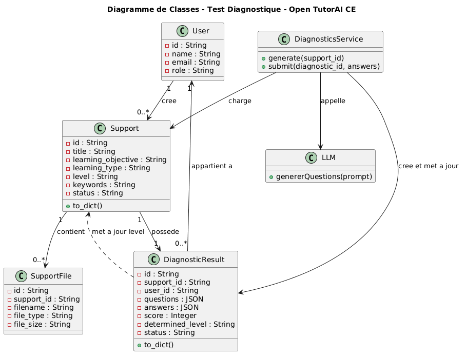
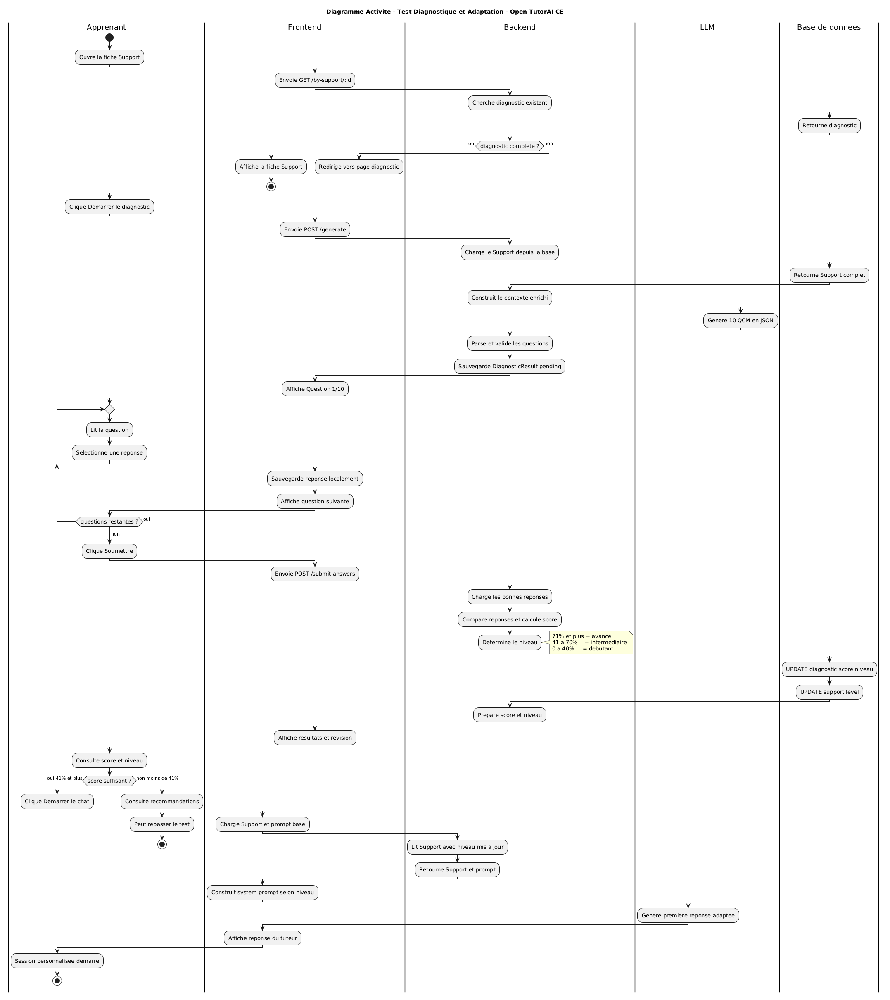
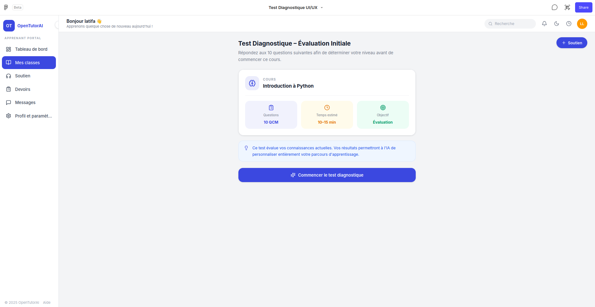
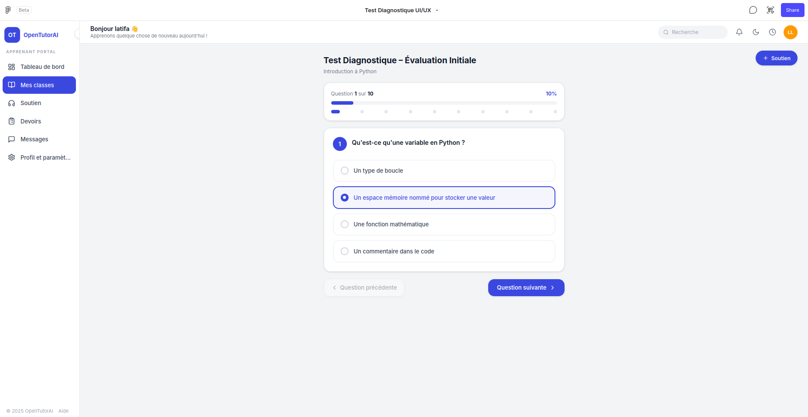
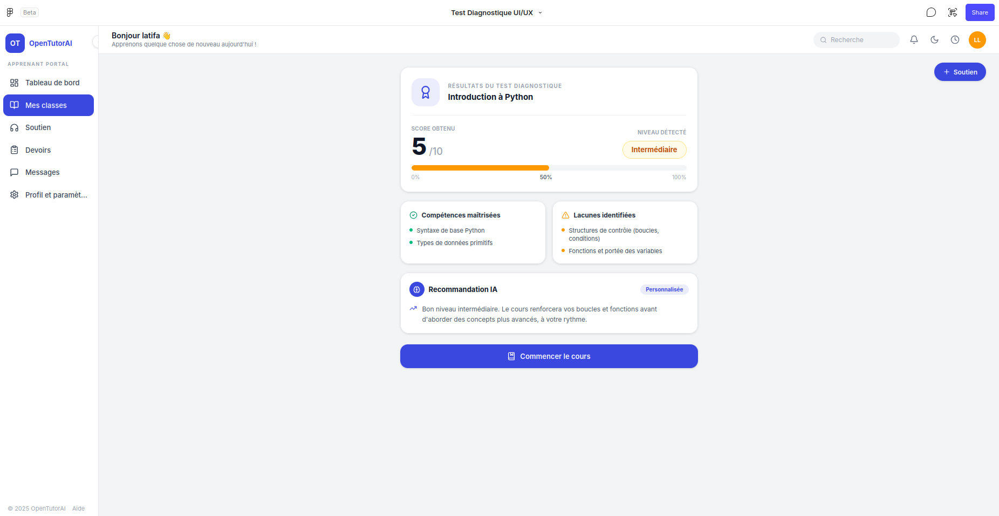

# Feature — Adaptive Diagnostic Test

> Internal technical documentation — Contribution to **Open TutorAI CE**
> Author: Latifa Aznague | June 2026

---

## Table of Contents

1. [Technical Overview](#technical-overview)
2. [Detailed Architecture](#detailed-architecture)
3. [Endpoint Specifications](#endpoint-specifications)
4. [Data Models](#data-models)
5. [Key Algorithms](#key-algorithms)
6. [Frontend Logic](#frontend-logic)
7. [Unit Tests](#unit-tests)
8. [Deployment Notes](#deployment-notes)
9. [Known Issues and Limitations](#known-issues-and-limitations)

---

## Technical Overview

### Purpose

Insert a mandatory diagnostic test between accessing a learning support and opening the
pedagogical chat. The test is dynamically generated by the LLM from the **full support
content** (title, description, learning objective, keywords, learning type, declared level,
uploaded files), then the result is persisted and used to adapt the AI tutor's system prompt.

### Stack

| Layer | Technology | Role in the feature |
|---|---|---|
| Database | SQLAlchemy + SQLite / PostgreSQL | Result persistence |
| Backend | FastAPI | 4 REST endpoints |
| LLM | `ai.providers.proxy_json` | Question generation (timeout 120s) |
| Frontend | SvelteKit | Interactive quiz + access guard |

### New Files

| File | Type |
|---|---|
| `data/models/diagnostic.py` | ORM model |
| `learning/diagnostics/__init__.py` | Module declaration |
| `learning/diagnostics/repository.py` | Data access |
| `learning/diagnostics/service.py` | Business logic |
| `gateway/http/routers/diagnostics.py` | FastAPI router |
| `ui/src/lib/apis/diagnostics/index.ts` | TypeScript API client |
| `ui/src/lib/components/student/pages/DiagnosticTest.svelte` | Quiz interface |
| `ui/src/routes/student/support/[id]/diagnostic/` | SvelteKit route |

### Modified Files

| File | Change |
|---|---|
| `data/models/__init__.py` | Import `DiagnosticResult` model |
| `gateway/http/app.py` | Register diagnostics router |
| `gateway/http/dependencies.py` | Add `get_diagnostics_service` |
| `ui/src/lib/components/student/pages/SupportDetails.svelte` | Access guard + redirect |
| `ui/src/lib/components/student/tutor/Chat.svelte` | Adapt system prompt based on `support.level` |

---

## Detailed Architecture

### Full Data Flow

```
┌─────────────────────────────────────────────────────────────┐
│                        FRONTEND                             │
│                                                             │
│  [SupportDetails.svelte]                                    │
│    onMount()                                                │
│      └─► GET /api/v1/diagnostics/by-support/{id}            │
│              │                                              │
│         ┌───┴──────────────────────────────┐               │
│  null or status ≠ 'completed'  status === 'completed'       │
│         ▼                                  ▼               │
│  goto('/diagnostic')              diagnosticCompleted=true  │
│         │                         (chat access enabled)     │
│         ▼                                                   │
│  [DiagnosticTest.svelte]                                    │
│    Learner clicks "Start Diagnostic"                        │
│    POST /generate { support_id, model_id }                  │
│    ← DiagnosticResult { status:'pending', questions:[...] } │
│    Step-by-step display (1 question / screen)               │
│    POST /{id}/submit { answers:[{question_id, answer}] }    │
│    ← DiagnosticResult { status:'completed', score, level }  │
│    Display result + answer review                           │
│    goto('/student/support/:id') → SupportDetails            │
└─────────────────────────────────────────────────────────────┘
                          │           ▲
                    HTTP  │           │  JSON
                          ▼           │
┌─────────────────────────────────────────────────────────────┐
│                        BACKEND                              │
│                                                             │
│  [diagnostics.py router]                                    │
│    Auth: Depends(get_current_user)                          │
│    Service: Depends(get_diagnostics_service)                │
│         │                                                   │
│         ▼                                                   │
│  [DiagnosticsService]                                async  │
│    generate()  ──► builds enriched context                  │
│                    (title + description + objective +        │
│                     keywords + learning_type + level + files)│
│                ──► [ai.providers.proxy_json] timeout=120s   │
│                    ← 10 JSON questions                       │
│                    _parse_questions_json() (JSON cleanup)    │
│                ──► [DiagnosticRepository].create()          │
│                                                             │
│    submit()    ──► compares answers to correct_answer       │
│                    computes score, determines level          │
│                ──► [DiagnosticRepository].update()          │
│                ──► [SupportRepository].update(level=...)    │
│         │                                                   │
│         ▼                                                   │
│  [DiagnosticRepository]                                     │
│    CRUD on diagnostic_results table                         │
│         │                                                   │
│         ▼                                                   │
│  [SQLAlchemy Session] → Database                            │
└─────────────────────────────────────────────────────────────┘
```

### Module Dependencies

```
gateway/http/routers/diagnostics.py
    └── Depends(get_current_user)        ← gateway/http/dependencies.py
    └── Depends(get_diagnostics_service) ← gateway/http/dependencies.py
            └── DiagnosticsService       ← learning/diagnostics/service.py
                    └── DiagnosticRepository ← learning/diagnostics/repository.py
                            └── DiagnosticResult ← data/models/diagnostic.py
                    └── SupportRepository    ← learning/supports/repository.py
                    └── proxy_json           ← ai/providers/proxy.py
```

---

## Endpoint Specifications

> **Common prefix:** `/api/v1/diagnostics`
> **Auth required:** JWT Bearer on all endpoints

### `POST /generate`

Generates a diagnostic test via the LLM from the full support content.

**Body**

```json
{
  "support_id": "string (UUID)",
  "model_id": "string (LLM model identifier)"
}
```

**Internal processing**

1. Load `Support` via `SupportRepository`
2. Build an enriched context block from all available fields:
   `title`, `short_description`, `learning_objective`, `keywords`,
   `learning_type`, `level`, `content_language`, uploaded file names
3. Call `proxy_json()` with timeout 120s
4. Clean and parse JSON via `_parse_questions_json()` (handles markdown fences)
5. Persist with `status = 'pending'`

**Response 200**

```json
{
  "id": "string (UUID)",
  "support_id": "string",
  "user_id": "string",
  "questions": [
    {
      "id": 1,
      "question": "What is the definition of ... ?",
      "choices": [
        "First complete answer",
        "Second complete answer",
        "Third complete answer",
        "Fourth complete answer"
      ],
      "correct_answer": "First complete answer",
      "explanation": "Brief explanation of the correct answer"
    }
  ],
  "answers": null,
  "score": null,
  "determined_level": null,
  "status": "pending",
  "created_at": "2026-06-23T19:24:23",
  "updated_at": "2026-06-23T19:24:23"
}
```

**Errors**

| Code | Cause |
|---|---|
| 404 | Support not found |
| 403 | Support does not belong to the user |
| 429 | Rate limit exceeded — max 10 calls per minute per user |
| 502 | LLM unavailable or returned invalid JSON |

---

### `POST /{id}/submit`

Submits answers, computes the score, and updates the support level.

> **Critical declaration order:** this route must be declared **after**
> `/by-support/{support_id}` in the router to prevent FastAPI from interpreting
> `by-support` as an `{id}`.

**Path parameter**

| Parameter | Type | Description |
|---|---|---|
| `id` | UUID | Identifier of the generated diagnostic |

**Body**

```json
{
  "answers": [
    { "question_id": 1, "answer": "Exact text of the selected choice" },
    { "question_id": 2, "answer": "Exact text of the selected choice" }
  ]
}
```

> `answer` is the **full text** of one of the choices — not a numeric index.
> If the diagnostic is already `completed`, the service returns the existing result (no error).

**Internal processing**

1. Load diagnostic — verify `user_id` matches
2. If `status == 'completed'` → return existing result
3. Build `correct_map = { str(q.id): q.correct_answer for q in questions }`
4. Count correct answers by exact text comparison
5. Compute `score = round((correct_count / 10) × 100)`
6. Determine `determined_level` via thresholds
7. Update `diagnostic_results` (`score`, `determined_level`, `answers`, `status = 'completed'`)
8. Update `supports.level = determined_level`

**Response 200**

```json
{
  "id": "string",
  "support_id": "string",
  "user_id": "string",
  "questions": [...],
  "answers": [{"question_id": 1, "answer": "..."}],
  "score": 70,
  "determined_level": "intermediate",
  "status": "completed",
  "created_at": "2026-06-23T19:24:23",
  "updated_at": "2026-06-23T19:30:00"
}
```

**Errors**

| Code | Cause |
|---|---|
| 404 | Diagnostic not found |
| 403 | Diagnostic does not belong to the user |
| 429 | Rate limit exceeded — max 10 calls per minute per user |

---

### `GET /by-support/{support_id}`

Retrieves the user's latest diagnostic result for a support.

> **Declaration:** must appear **before** `GET /{id}` in the router.

**Response 200 — existing test**

```json
{
  "id": "string",
  "support_id": "string",
  "score": 70,
  "determined_level": "intermediate",
  "status": "completed | pending",
  "created_at": "2026-06-23T19:24:23"
}
```

**Response 200 — no test**

```json
null
```

> Always HTTP 200. `SupportDetails.svelte` redirects if the value is `null` or
> if `status ≠ 'completed'`.

---

### `GET /{id}`

Retrieves a diagnostic by its identifier.

**Response 200**

```json
{
  "id": "string",
  "support_id": "string",
  "questions": [...],
  "status": "pending | completed",
  "created_at": "string"
}
```

**Errors**

| Code | Cause |
|---|---|
| 404 | Diagnostic not found |
| 403 | Diagnostic does not belong to the user |

---

## Data Models

### SQLAlchemy ORM — `DiagnosticResult`

```python
# data/models/diagnostic.py

class DiagnosticResult(Base):
    __tablename__ = "diagnostic_results"

    id               = Column(String(36), primary_key=True, default=lambda: str(uuid.uuid4()))
    support_id       = Column(String(36), ForeignKey("supports.id", ondelete="CASCADE"), nullable=False, index=True)
    user_id          = Column(String(36), ForeignKey("users.id"), nullable=False, index=True)
    questions        = Column(JSON, nullable=True)   # list of dicts {id, question, choices, correct_answer, explanation}
    answers          = Column(JSON, nullable=True)   # list of dicts {question_id, answer}
    score            = Column(Integer, nullable=True) # 0–100
    determined_level = Column(String(100), nullable=True)  # "beginner" | "intermediate" | "advanced"
    status           = Column(String(50), default="pending") # "pending" | "completed"
    created_at       = Column(DateTime, default=datetime.utcnow, nullable=False)
    updated_at       = Column(DateTime, default=datetime.utcnow, onupdate=datetime.utcnow, nullable=False)

    support = relationship("Support", backref="diagnostic_results")
    user    = relationship("User")
```

### `questions` field structure (JSON)

```json
[
  {
    "id": 1,
    "question": "What is the definition of ... ?",
    "choices": [
      "First complete answer",
      "Second complete answer",
      "Third complete answer",
      "Fourth complete answer"
    ],
    "correct_answer": "First complete answer",
    "explanation": "Brief explanation"
  }
]
```

> Grading is done by **exact text comparison** (`answer == correct_answer`),
> not by numeric index.

### `answers` field structure (JSON)

```json
[
  { "question_id": 1, "answer": "First complete answer" },
  { "question_id": 2, "answer": "Third complete answer" }
]
```

---

## Key Algorithms

### LLM context construction (`service.generate`)

```python
context_lines = [f'TOPIC: "{support.title}"']

if support.short_description:
    context_lines.append(f"DESCRIPTION: {support.short_description}")

if support.learning_objective:
    context_lines.append(f"LEARNING OBJECTIVE: {support.learning_objective}")

if support.keywords:
    context_lines.append(f"KEY CONCEPTS TO COVER: {support.keywords}")

if support.learning_type == "exam":
    context_lines.append("CONTEXT: exam preparation — test precise recall...")
elif support.learning_type == "skill":
    context_lines.append("CONTEXT: skill-based learning — practical application...")
elif support.learning_type == "course":
    context_lines.append("CONTEXT: course — assess prerequisite knowledge...")

if support.level:
    context_lines.append(f"DECLARED EDUCATION LEVEL: {support.level}")

file_names = [f.filename for f in (support.files or [])]
if file_names:
    context_lines.append("UPLOADED MATERIALS: " + ", ".join(file_names))
```

The prompt is sent to the LLM with `timeout=120s` via `proxy_json()`.

### LLM response cleanup (`_parse_questions_json`)

```python
def _parse_questions_json(raw: str) -> List[Dict]:
    # Remove markdown fences (```json ... ```)
    cleaned = re.sub(r"```(?:json)?\s*", "", raw).strip().rstrip("`").strip()
    try:
        return json.loads(cleaned)
    except json.JSONDecodeError:
        pass
    # Fallback: extract between first '[' and last ']'
    start = cleaned.find("[")
    end = cleaned.rfind("]") + 1
    if start == -1 or end == 0:
        log.error("No JSON array in LLM response:\n%s", raw[:500])
        raise ValueError("LLM did not return a JSON array")
    return json.loads(cleaned[start:end])
```

### Score computation and level determination (`service.submit`)

```python
_LEVEL_THRESHOLDS = [
    (71, "advanced"),
    (41, "intermediate"),
    (0,  "beginner"),
]

# Exact text comparison (not by index)
correct_map = {str(q["id"]): q["correct_answer"] for q in questions}
correct_count = sum(
    1 for a in answers
    if str(a.get("question_id")) in correct_map
    and a.get("answer") == correct_map[str(a.get("question_id"))]
)
score = round((correct_count / len(questions)) * 100)

determined_level = "beginner"
for threshold, label in _LEVEL_THRESHOLDS:
    if score >= threshold:
        determined_level = label
        break
```

> Exact thresholds: score ≥ 71 → advanced, score ≥ 41 → intermediate, otherwise → beginner.
> So 40% = beginner, 41% = intermediate.

### Level propagation to support

```python
# Two database writes after submission
self.repo.update(diagnostic_id, answers=answers, score=score,
                 determined_level=determined_level, status="completed", ...)

self.support_repo.update(diagnostic.support_id, level=determined_level, ...)
```

---

## Frontend Logic

### `DiagnosticTest.svelte` — Technical Notes

#### Retrieving `support_id` from route parameters

```svelte
<script lang="ts">
  import { page } from '$app/stores';
  $: supportId = $page.params.id ?? '';
</script>
```

#### Step-by-step navigation and answer management

```svelte
<script lang="ts">
  let currentStep = 0;
  let answers: Record<number, string> = {};

  function selectAnswer(questionId: number, choice: string) {
    answers = { ...answers, [questionId]: choice };
  }

  $: questions = (diagnostic?.questions ?? []) as DiagnosticQuestion[];
  $: totalSteps = questions.length;
  $: currentQuestion = questions[currentStep] ?? null;
  $: allAnswered = totalSteps > 0 && Object.keys(answers).length === totalSteps;
</script>
```

The `{ ...answers, [id]: choice }` spread forces reassignment and triggers Svelte
reactivity on every selection.

#### Submission

```svelte
async function handleSubmit() {
  const payload: DiagnosticAnswer[] = Object.entries(answers).map(([qId, ans]) => ({
    question_id: Number(qId),
    answer: ans   // full text of the choice, not an index
  }));
  diagnostic = await submitDiagnostic(token, diagnostic.id, payload);
}
```

### `SupportDetails.svelte` — Access Guard

```svelte
<script lang="ts">
  import { getDiagnosticBySupport } from '$lib/apis/diagnostics';

  let diagnosticCompleted = false;

  onMount(async () => {
    try {
      const diag = await getDiagnosticBySupport(token, supportId);
      if (!diag || diag.status !== 'completed') {
        goto(`/student/support/${supportId}/diagnostic`);
        return;
      }
      diagnosticCompleted = true;
    } catch {
      goto(`/student/support/${supportId}/diagnostic`);
    }
  });
</script>
```

### `Chat.svelte` — System Prompt Adaptation

`generateSupportSystemPrompt()` loads the support via the API, reads `support.level`
(updated by the diagnostic) and builds the prompt:

```javascript
const supportDetails = await getSupportById(token, supportId);

if (supportDetails.level === 'beginner') {
  systemPrompt += `DIAGNOSED KNOWLEDGE LEVEL: Beginner\n`;
  systemPrompt += `- Assume zero prior knowledge. Start from first principles.\n`;
  systemPrompt += `- Introduce ONE concept at a time.\n`;
  systemPrompt += `- Use simple vocabulary, define every technical term.\n`;
  systemPrompt += `- Warm, patient, encouraging tone. Slow pace.\n`;
} else if (supportDetails.level === 'intermediate') {
  systemPrompt += `DIAGNOSED KNOWLEDGE LEVEL: Intermediate\n`;
  systemPrompt += `- Build on existing knowledge, introduce nuances progressively.\n`;
  systemPrompt += `- Balanced pace, moderate complexity.\n`;
} else if (supportDetails.level === 'advanced') {
  systemPrompt += `DIAGNOSED KNOWLEDGE LEVEL: Advanced\n`;
  systemPrompt += `- Skip basics, focus on edge cases and trade-offs.\n`;
  systemPrompt += `- Use technical language freely, treat learner as a peer.\n`;
  systemPrompt += `- Fast pace, challenging exercises.\n`;
}
```

> `support.level` is read from the API at each chat start — it is not a Svelte prop
> passed from the parent.

### TypeScript API Client — `ui/src/lib/apis/diagnostics/index.ts`

```typescript
// All functions take token as the first parameter

export const generateDiagnostic = async (
  token: string,
  supportId: string,
  modelId: string
): Promise<DiagnosticResult> => {
  const res = await fetch(`${TUTOR_API_BASE_URL}/diagnostics/generate`, {
    method: 'POST',
    headers: { Authorization: `Bearer ${token}`, 'Content-Type': 'application/json' },
    body: JSON.stringify({ support_id: supportId, model_id: modelId })
  });
  if (!res.ok) throw await res.json();
  return res.json();
};

export const submitDiagnostic = async (
  token: string,
  diagnosticId: string,
  answers: DiagnosticAnswer[]   // [{question_id: number, answer: string}]
): Promise<DiagnosticResult> => {
  const res = await fetch(`${TUTOR_API_BASE_URL}/diagnostics/${diagnosticId}/submit`, {
    method: 'POST',
    headers: { Authorization: `Bearer ${token}`, 'Content-Type': 'application/json' },
    body: JSON.stringify({ answers })
  });
  if (!res.ok) throw await res.json();
  return res.json();
};

export const getDiagnosticBySupport = async (
  token: string,
  supportId: string
): Promise<DiagnosticResult | null> => {
  const res = await fetch(`${TUTOR_API_BASE_URL}/diagnostics/by-support/${supportId}`, {
    headers: { Authorization: `Bearer ${token}` }
  });
  if (!res.ok) throw await res.json();
  return res.json();   // null if no diagnostic
};
```

---

## Diagrams

### Class Diagram



*Relationships between `DiagnosticResult`, `Support`, `DiagnosticsService`, `DiagnosticRepository`, `SupportRepository` and `BaseRepository<T>`.*

---

### Activity Diagram



*Internal service activities: LLM context construction, `proxy_json` call, JSON cleanup, score computation, `Support.level` update.*

---

### Reference Mockups

The mockups guided the implementation of `DiagnosticTest.svelte`:

| Start | Taking the test | Results |
|---|---|---|
|  |  |  |

---

## Unit Tests

**File:** `tests/tests/test_diagnostics.py`
**Framework:** pytest + SQLite in-memory + mock LLM via `monkeypatch`

### Mock Strategy

The LLM is mocked on `proxy_json` to avoid network calls in CI:

```python
MOCK_QUESTIONS = [
    {
        "id": i,
        "question": f"Question {i}?",
        "choices": ["Answer A", "Answer B", "Answer C", "Answer D"],
        "correct_answer": "Answer A",
        "explanation": "Explanation"
    }
    for i in range(1, 11)
]

@pytest.fixture
def mock_llm(monkeypatch):
    async def fake_proxy(*args, **kwargs):
        return {"choices": [{"message": {"content": json.dumps(MOCK_QUESTIONS)}}]}
    monkeypatch.setattr("learning.diagnostics.service.proxy_json", fake_proxy)
```

### Test Cases

| Test | Scenario | Expected result |
|---|---|---|
| `test_generate_creates_pending` | POST /generate | status `pending`, 10 questions |
| `test_generate_invalid_llm_response` | LLM returns malformed JSON | HTTP 502 |
| `test_submit_score_zero` | 0 correct answers | score=0, level=`beginner` |
| `test_submit_score_50` | 5 correct answers | score=50, level=`intermediate` |
| `test_submit_score_100` | 10 correct answers | score=100, level=`advanced` |
| `test_submit_updates_support_level` | Valid submission | `support.level` updated |
| `test_submit_already_completed` | Double submission | returns existing result (200) |
| `test_submit_wrong_user` | user_id ≠ owner | HTTP 403 |
| `test_by_support_completed` | Completed test | HTTP 200 with level |
| `test_by_support_not_found` | No test | HTTP 200 with null |
| `test_get_by_id` | Retrieve by ID | HTTP 200 |

---

## Deployment Notes

### Database Migration

The `diagnostic_results` table is created automatically via `Base.metadata.create_all()`
on application startup. Adding Alembic is recommended before production.

### Required Environment Variables

No variables specific to this module. The LLM provider configured in the admin interface is used automatically.

### Route Registration Order

```python
# gateway/http/app.py
from gateway.http.routers import diagnostics
app.include_router(diagnostics.router, prefix="/api/v1/diagnostics", tags=["diagnostics"])
```

The order within the router (`by-support` before `{id}`) is critical to avoid
FastAPI path parameter conflicts.

### Performance Impact

Each call to `/generate` triggers an LLM call with a 120s timeout.
A loading indicator is displayed in `DiagnosticTest.svelte` during generation.

---

## Known Issues and Limitations

### 1. No retry on LLM failure

**Impact:** If the LLM returns invalid JSON after cleanup, the student receives
a 502 error with no automatic retry option.
**Proposed solution:** Retry with exponential backoff (max 3 attempts) in `service.generate()`.

### 2. One test per support per user

**Impact:** The student cannot retake the test to improve their profile.
**Proposed solution:** Keep the history and filter on the most recent `completed` entry.

### 3. Questions not linguistically verified

**Impact:** The language of questions depends on the LLM — may vary if `content_language`
is absent from the support.
**Proposed solution:** Validate language via post-generation detection.

### 4. `correct_answer` stored in database

**Impact:** A student who accesses `GET /{id}` with developer tools
can see the correct answers.
**Recommended mitigation:** Create a Pydantic schema `QuestionPublic` (without
`correct_answer` or `explanation`) distinct from `QuestionInternal`, and use it
in the `GET /{id}` response while `status == 'pending'`.
