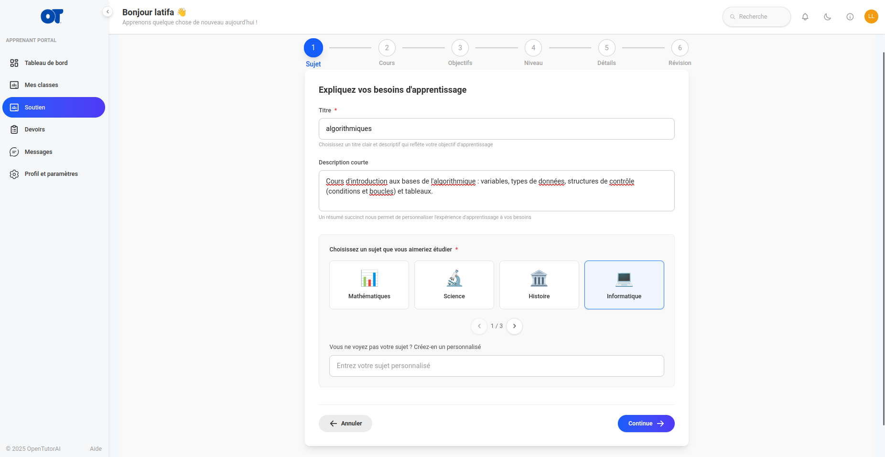
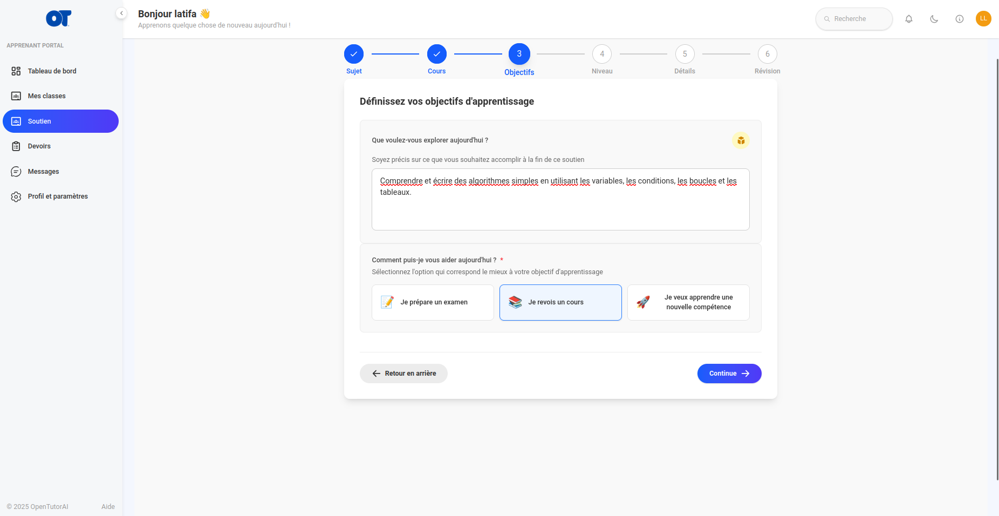
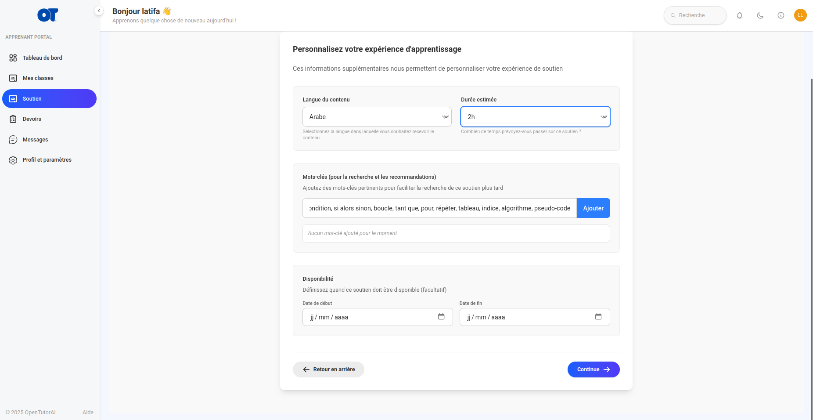
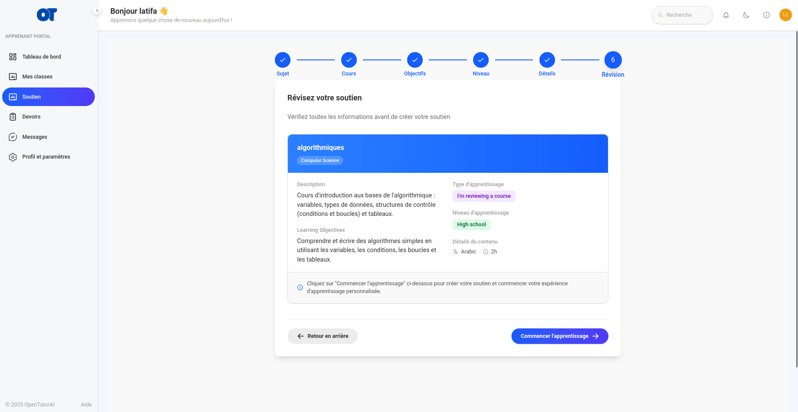
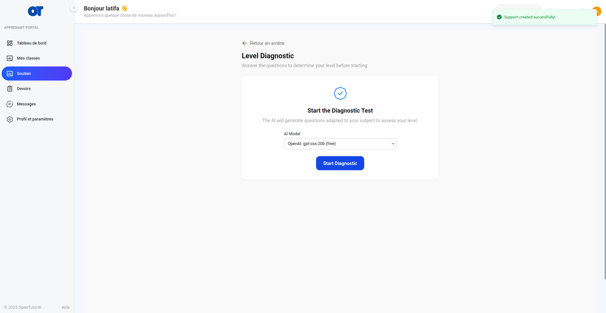
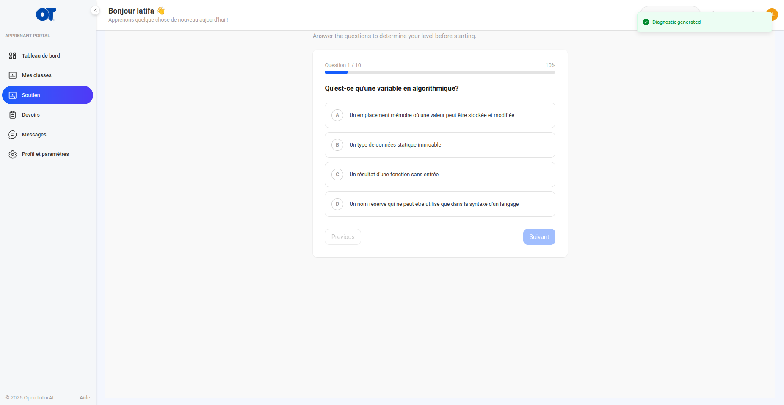
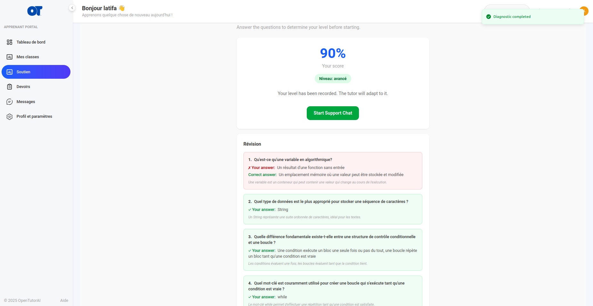
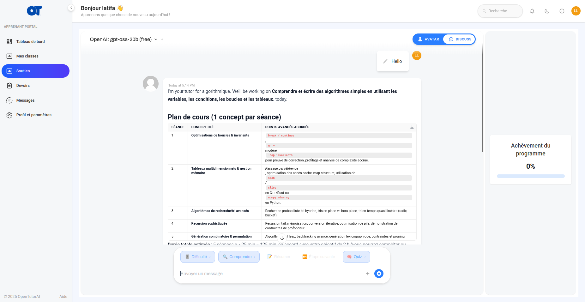

# User Guide — Adaptive Diagnostic Test

> **Open TutorAI CE** — Adaptive Diagnostic Test
> Last updated: June 2026

---

## Table of Contents

1. [Overview](#overview)
2. [Student Guide](#student-guide)
   - [Before You Begin](#before-you-begin)
   - [Taking the Test Step by Step](#taking-the-test-step-by-step)
   - [Understanding Your Result](#understanding-your-result)
   - [Accessing the Chat After the Test](#accessing-the-chat-after-the-test)
3. [Frequently Asked Questions](#frequently-asked-questions)

---

## Overview

Before being able to chat with the AI tutor on a learning support, each student
takes a **10-question diagnostic test**. The questions are automatically generated
by the LLM from the **full support content**: title, description, learning objective,
keywords, learning type, and uploaded files.
They are written in the **language configured on the support** (`content_language`).

At the end of the test, a **level** is assigned — beginner, intermediate, or advanced.
The AI tutor uses this level to adapt its explanations throughout the chat session:
a beginner receives clear definitions and concrete step-by-step examples,
an advanced learner gets in-depth technical responses without revisiting the basics.

The test is mandatory and cannot be skipped. It is taken only once per learning support.

---

## Student Guide

### Before You Begin

Make sure you are logged in to your student account and that an AI model is
configured on the platform — it is required to generate your questions.

Set aside a few quiet minutes. There is no time limit,
but it is best to answer without interruption so your result
accurately reflects your actual level.

---

### Taking the Test Step by Step

**Step 1 — Create a support (title, description, subject)**

From your dashboard, enter the support title, a short description,
and select your subject. This information serves as the basis for generating
the diagnostic test questions.

---

**Step 1b — Define the objective and learning type**

Describe what you want to achieve by the end of the support and choose the type:
"I am preparing for an exam", "I am reviewing a course", or "I want to learn a new skill".
The learning type influences the style of the generated questions.

---

**Step 1c — Customize details (language, keywords, duration)**

Select the content language, enter the subject keywords, and estimate the duration.
**Keywords are directly used by the LLM** to target specific concepts in the diagnostic test questions.

---

**Step 1d — Review before creation**

Check the summary of your support (title, description, objective, type,
level, language, duration) before clicking "Start Learning". Once
created, you will be redirected to the diagnostic test.

If you open an already created support without a completed test, you are also
automatically redirected to the test page.

---

**Step 2 — Start the diagnostic**

On the test page, select the AI model to use (if several are
available) then click the **"Start Diagnostic"** button.

A brief loading screen appears while the AI tutor generates your
10 personalized questions based on your support content.

---

**Step 3 — Answer the questions**

Questions appear one at a time. For each question:

- Read the question carefully
- Click on the answer that seems correct from the four options
- Your selection is highlighted — you can change it before moving to the next
- Click **"Next"** to go to the next question (the button is active only
  if you have selected an answer)
- You can go back with the **"Previous"** button

> There is no penalty for a wrong answer. Answer honestly
> to get a level that genuinely matches your knowledge.

---

**Step 4 — Submit the test**

On the last question, once all answers are entered, the
**"Submit"** button becomes active. Click it to send your answers.

---

**Step 5 — View your result**

Your score and level are displayed immediately. A detailed summary
shows for each question: your answer, whether it is correct or not,
the correct answer, and an explanation.

---

### Understanding Your Result

| Assigned Level | Score | What it means |
|---|---|---|
| **Beginner** | 0 – 40% | You are discovering the subject. The tutor will start from scratch, introduce one concept at a time, use simple vocabulary and everyday examples. |
| **Intermediate** | 41 – 70% | You have solid foundations. The tutor will deepen concepts, progressively introduce nuances and complex cases. |
| **Advanced** | 71 – 100% | You have mastered the subject. The tutor will go directly to advanced technical aspects, without revisiting the basics. |

Whatever your result, the tutor remains supportive and available.
The level is only used to adapt the response style, not to limit
the questions you can ask.

---

### Accessing the Chat After the Test

Once the test is submitted, click the **"Start Chat"** button.
You are redirected to the chat session for this support.

The AI tutor already knows your level: it starts directly with adapted content,
without asking you to introduce yourself or explain your level.
In the example above (advanced level), the tutor immediately proposes a structured
lesson plan on advanced concepts.

---

## Frequently Asked Questions

**Can I retake the test if I am not satisfied with my result?**

No, not in this version. The test is taken only once per support.
This constraint is intentional: the diagnosed level must reflect
your actual level. A retake option will be considered in a future version.

---

**What happens if I leave the page before finishing?**

The test remains in "pending" status. Your intermediate answers are not
saved — only the generated test is kept in the database. The next time you
open this support, you will be redirected to the test and will need to answer
again from the beginning.

---

**Is the test the same for everyone?**

No. The questions are generated by the LLM from the specific content
of each support (title, objective, keywords…). Two students taking the
test on the same support may therefore receive different questions.

---

**In what language are the questions asked?**

Questions are generated in the language configured on the learning support
(`Content Language`). If the support is configured in French, the questions
will be in French, regardless of your personal language setting.

---

**Does the tutor know my detailed answers?**

No. The AI tutor only receives your **level** (beginner, intermediate, or
advanced). Your individual answers remain private and are only accessible
to teachers via the API.

---

**Is the chat permanently blocked if I fail the test?**

No. There is no minimum score to access the chat. Whatever your
result — even 0% — the test is considered completed as soon as you
submit it. Chat access is unlocked immediately afterwards.

---

**Can the assigned level evolve over time?**

Not automatically in this version. The level is set at the time of the test
and remains associated with the support. Repeated chat sessions do not trigger
a profile update. Progressive re-evaluation is planned in a future version.

---

*This guide is maintained by the Open TutorAI CE team.
To report an issue or suggest an improvement, open an issue on the project repository.*
