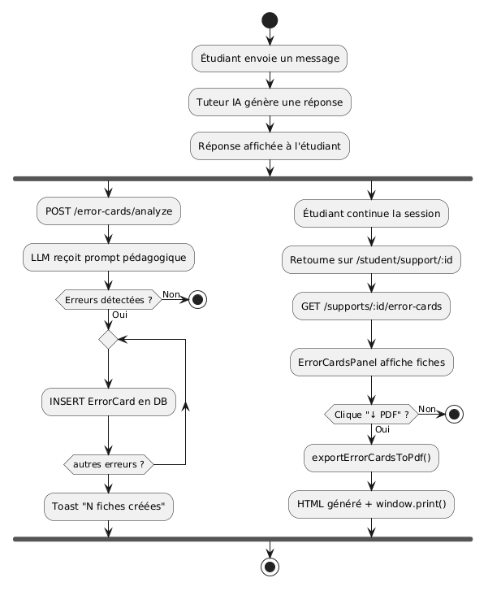
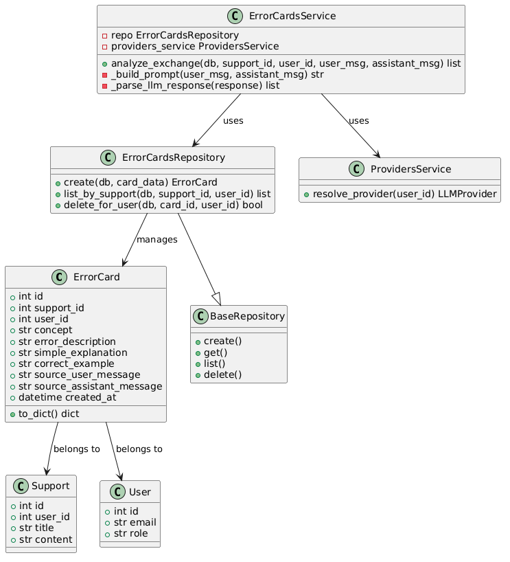
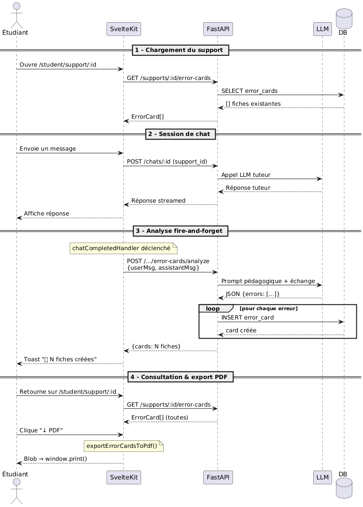
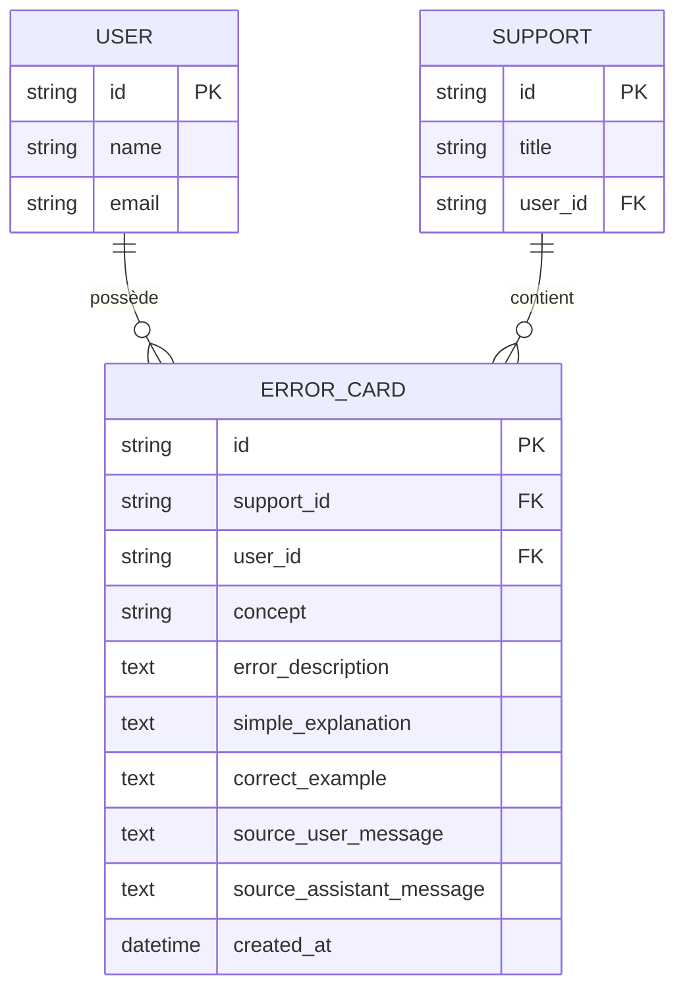
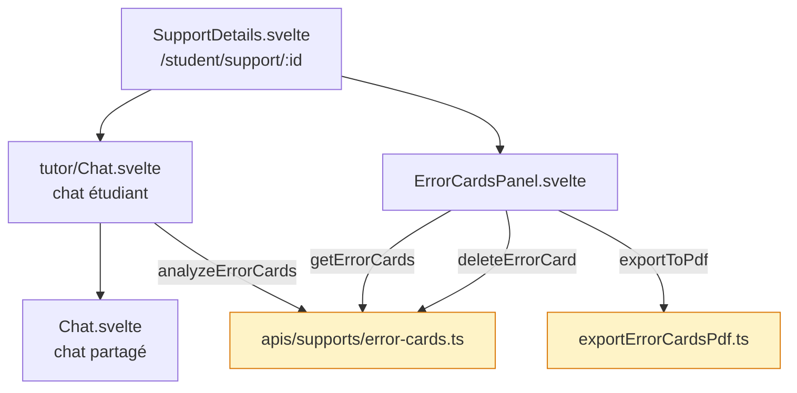
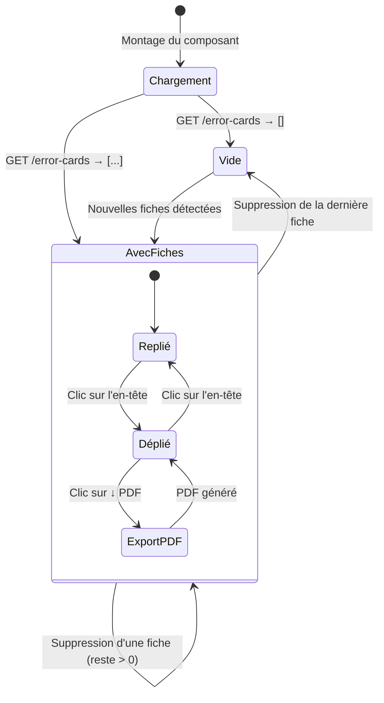

# Diagrammes UML — Carte d'erreur instantanée

Les fichiers image sont dans `docs/diagrams/`.
Les sources Mermaid supplémentaires sont disponibles en section repliable.

---

## 1. Diagramme d'activité — Flux complet

Montre le déroulement de bout en bout : envoi du message étudiant, génération de
la réponse tuteur, analyse fire-and-forget, insertion en DB, toast de notification,
puis consultation des fiches et export PDF.

---

## 2. Diagramme de classes — Domaine error_cards

Montre les relations entre `ErrorCardsService`, `ErrorCardsRepository`,
`BaseRepository`, `ProvidersService`, `ErrorCard`, `Support` et `User`.

---

## 3. Diagramme de séquence — Flux détaillé en 4 phases

**Phase 1 — Chargement du support :** `GET /supports/:id/error-cards` au montage
**Phase 2 — Session de chat :** appel LLM tuteur, réponse streamed
**Phase 3 — Analyse fire-and-forget :** `POST .../error-cards/analyze`, loop INSERT par erreur
**Phase 4 — Consultation & export PDF :** rechargement des fiches, `exportErrorCardsToPdf()`, `Blob → window.print()`

---

## Diagrammes Mermaid complémentaires

Diagramme entité-relation — Modèle de données

Diagramme de composants — Frontend

Diagramme d'état — Panneau ErrorCardsPanel

