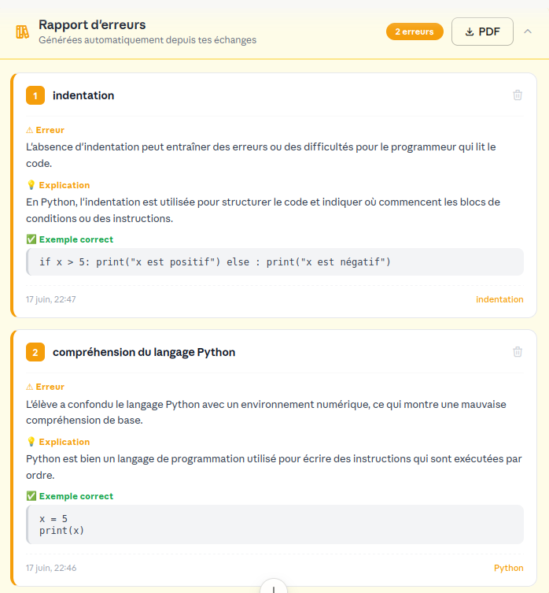
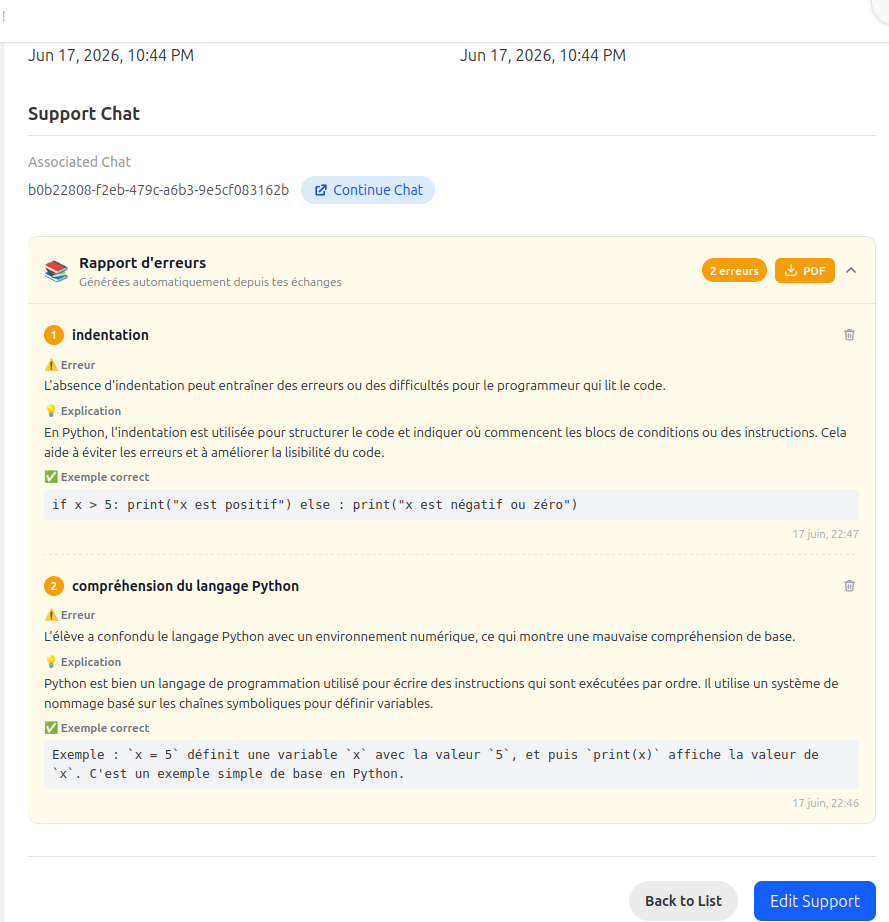
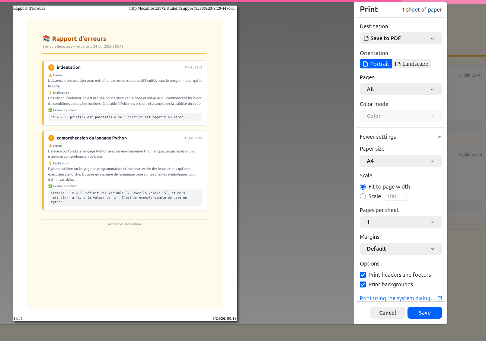

# Maquette & Screenshots — Carte d'erreur instantanée

Fichiers dans `docs/screenshots/`.

---

## Maquette — Panneau ouvert avec fiches

Vue design de référence : panneau "Rapport d'erreurs" déplié avec 2 fiches.

---

## Screenshots réels

### En-tête du panneau replié

Barre d'en-tête visible sans déplier : titre, badge "N erreurs", bouton PDF.

### Page support — panneau ouvert avec fiches

Page complète `/student/support/:id` avec le panneau déplié et les fiches détaillées.

### Export PDF — fenêtre d'impression

Aperçu PDF dans Chrome avant enregistrement (dialogue Print).

---

## Palette et composants

| Élément | Style |
|---------|-------|
| En-tête du panneau | Fond crème (#FEF9EE), icône livres, badge amber |
| Badge compteur | Fond amber-500, texte blanc, coins arrondis |
| Bouton PDF | Fond amber-500, icône téléchargement, texte blanc |
| Numéro de fiche | Pastille amber carrée arrondie |
| Label Erreur | Texte amber avec icône ⚠️ |
| Label Explication | Texte amber avec icône 💡 |
| Label Exemple correct | Texte vert avec icône ✅ |
| Exemple code | Fond gris clair, police monospace |
| Bouton supprimer | Icône corbeille gris, hover rouge |
