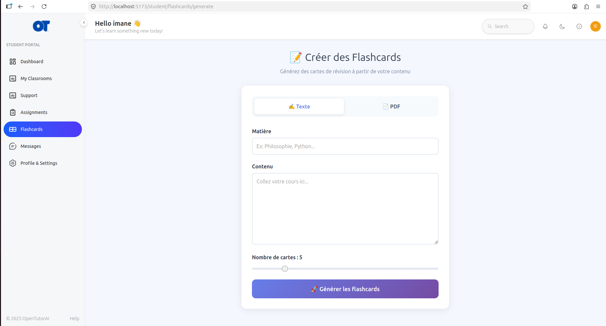
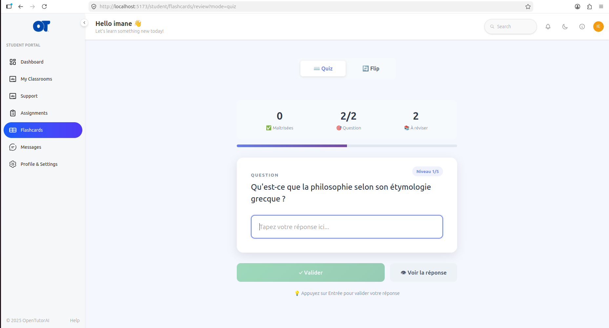
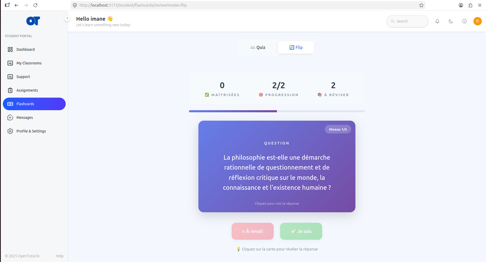
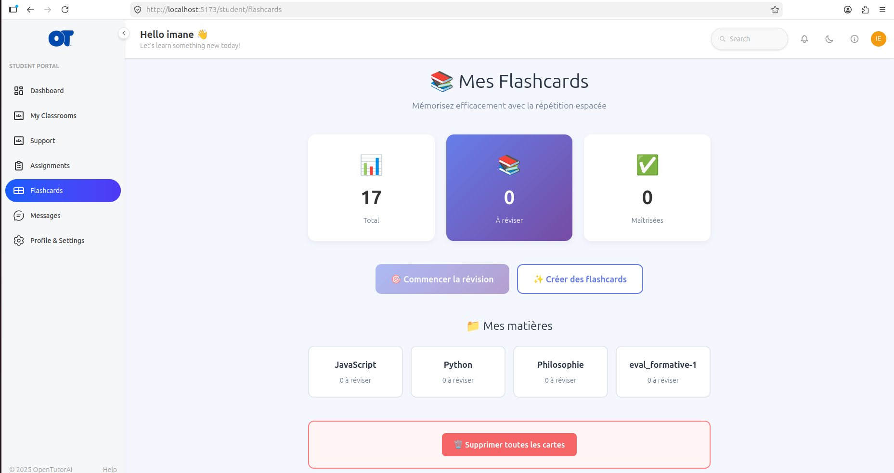

# Flashcards User Guide

## Overview
The Flashcards feature helps you memorize your courses efficiently. It automatically generates questions and answers from your notes or PDF files using Artificial Intelligence. You can then review them using two interactive modes: a fast Quiz mode or a classic Flip mode. The system uses spaced repetition to show you difficult cards more often and easy cards less often.

## Who uses it
- **Students**

## How to Generate Flashcards

### From Text
1. Click on **Flashcards** in the left sidebar.
2. Click the **Create flashcards** button.
3. Select the **✍️ Text** tab.
4. Paste your course content into the text area.
5. Enter a **Subject** (e.g., Philosophy, Python) to organize your cards.
6. Adjust the **Number of cards** slider (between 3 and 15).
7. Click **🚀 Generate flashcards**. The system will process your text and redirect you to the revision page.

### From PDF
1. On the generation page, select the **📄 PDF** tab.
2. Click the upload area and select your PDF file (max 10MB).
3. Choose the AI model: **Phi3 Mini** (faster) or **Qwen 2.5** (higher quality).
4. Enter a **Subject** if needed.
5. Click **Generate flashcards**.

*Figure 1: The flashcard generation interface with Text and PDF modes.*

## How to Review Your Flashcards

### Mode 1: Quiz (Interactive)
In this mode, you must type the answer to the question.
1. Go to the **Revision** page and select **⌨️ Quiz** mode.
2. Read the question displayed on the card.
3. Type your answer in the input field.
4. Press **Enter** or click **✓ Validate**.
5. The system will instantly tell you if you are correct or incorrect. 
   - *Note: The system is smart! It tolerates minor typos, ignores capitalization, and accepts partial matches.*

*Figure 2: The Quiz mode where the student types their answer.*

### Mode 2: Flip (Classic)
In this mode, you flip the card to reveal the answer.
1. Select **🔄 Flip** mode on the revision page.
2. Click anywhere on the card to flip it and see the answer.
3. Evaluate your knowledge:
   - Click **✅ I know** if you remembered correctly. The card will be scheduled for later.
   - Click **❌ Review again** if you forgot. The card will come back sooner.

*Figure 3: The Flip mode with 3D animation and review buttons.*

## Filtering by Subject
If you have created cards for multiple subjects:
1. Go to the **Flashcards Dashboard**.
2. You will see your subjects listed as cards (e.g., "Philosophy", "Python").
3. Click on a subject to review only the cards for that specific topic.

*Figure 4: The dashboard showing statistics and subject tags.*

## Managing Your Cards
- **Statistics**: The dashboard shows your total cards, cards due for review, and mastered cards.
- **Delete All**: At the bottom of the dashboard, you can click **🗑️ Delete all cards** to clear your entire flashcard history. (This action is irreversible).