# Teacher Section — User Guide

> **Audience:** teachers, students, and parents using Open TutorAI CE.
> **Companion docs:** `technical-reference.md` (API endpoints + data models) and `security.md`
> (security controls); this file is the plain-language _how-to_. Screenshots referenced below live
> in [`./screenshots/`](./screenshots/README.md).

## 1. Overview

The teacher section turns Open TutorAI from an individual tutor into a classroom-aware tool.
A teacher can create classes, build a roster, watch each student's learning progress, hand out
and grade assignments (including timed proctored exams), share resources, message students, and —
during class — control student screens and see who is online right now. Students get an
assignments inbox and a submission flow; parents can be linked to a student as guardians.

Everyone signs in with their role (teacher / student / parent), and each person only ever sees
the classes and people they're entitled to.

---

## 2. For teachers

### Create and manage a class

1. Open **Classes** in the sidebar and click **Create class**.
2. Fill in the guided wizard — subject, level, objective, language, optional capacity and
   schedule — then save.
3. Your new class appears as a card; click it to open its tabs (Roster, Progress, Assignments,
   Resources, Control, Invitations).

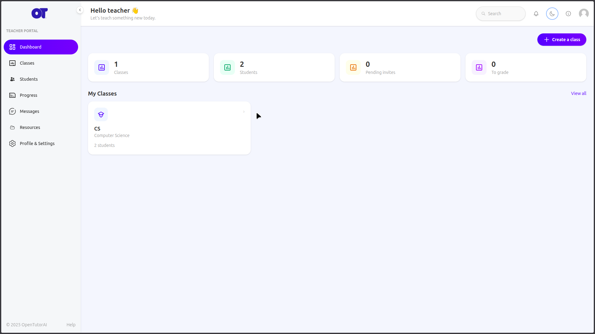
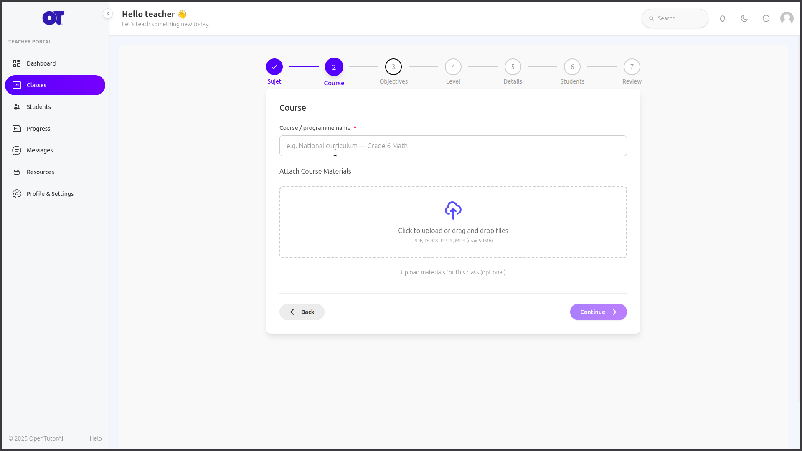

### Build the roster

1. In a class, open the **Roster** tab.
2. **Enrol** an existing student by email, or **Invite** someone who isn't on the platform yet —
   they receive a join link and land in your class once they accept.

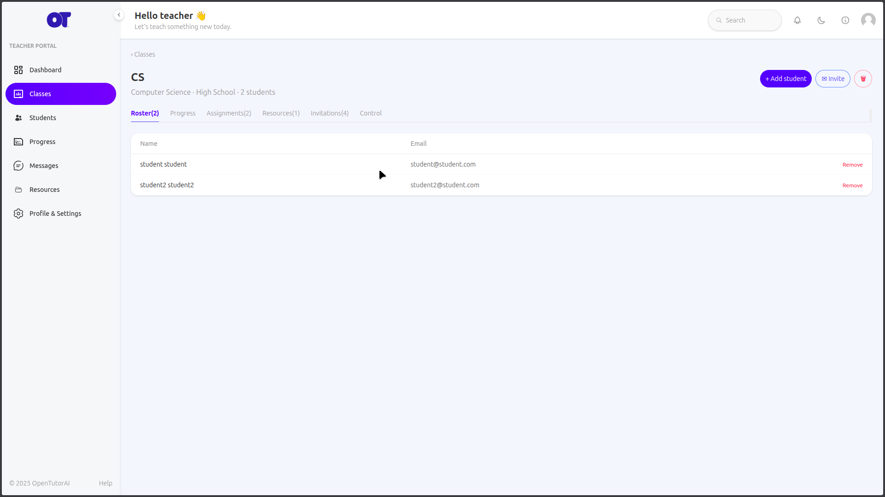

### See student progress

1. Open the **Progress** tab for a class-wide overview, or click a student to open their detail.
2. The view is **read-only** — it surfaces the student's learning activity (supports, status,
   recency, engagement) and never changes their data.

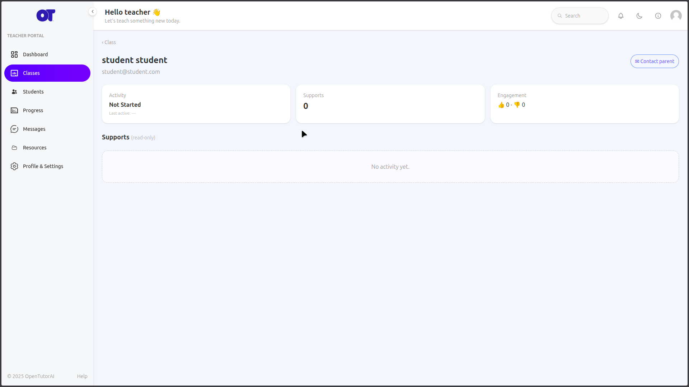

### Link a parent (guardians)

You can connect a student to their parent/guardian so you have a responsible adult to reach.

1. Open a student (from the **Roster** or **Students**), and find the **Guardians** section.
2. Click **Invite guardian** and enter the parent's email. They receive an invite; once they
   accept and link, the connection becomes **active**.
3. The student's guardians are listed with their status (**pending** until accepted, then
   **active**). You can **contact** a linked parent — at minimum an email link opens a message to
   their address.
4. _Scope:_ this release covers inviting, viewing, and contacting a parent. There is no parent
   dashboard yet — the guardian link simply gives you a way to reach them.

### Assignments and grading

1. In a class, open **Assignments** → **Create assignment**. Add a title, instructions, an
   optional file attachment and due date. Toggle **Exam** to make it a timed, full-screen
   proctored test.
2. Students submit text and/or a file. Open a submission and click **Grade** to enter a score and
   feedback, then **Return** it.
3. The status tracker shows who is on time, late, missing, or graded.

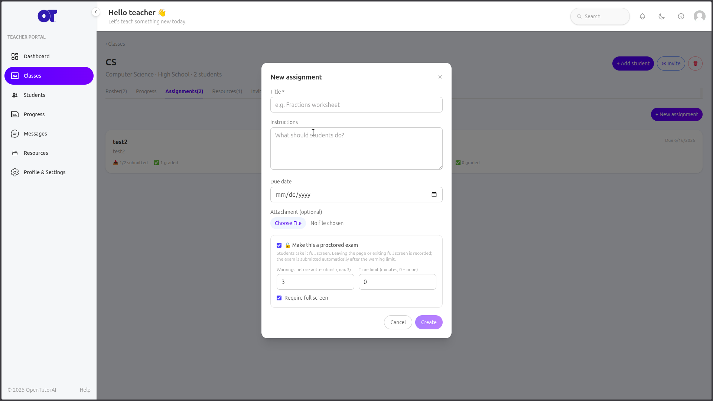
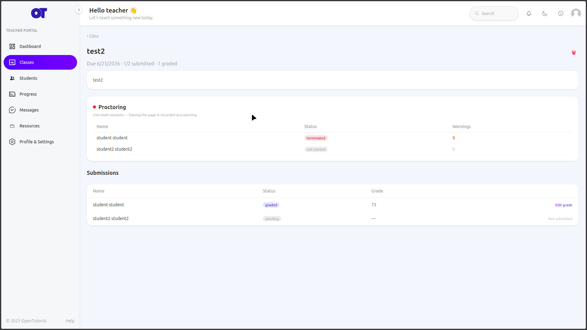

### Proctored exams (timed, full-screen)

When you toggle **Exam** on an assignment, students take it in a locked-down full-screen shell
with a countdown timer instead of the normal submission page.

1. **Set it up.** On the assignment, turn on **Exam** and set the time limit. The deadline plus the
   time limit define each student's window.
2. **Grace warnings → auto-submit.** If a student leaves the screen (switches tab, exits
   full-screen), they get a short series of **on-screen warnings** with a grace countdown. If they
   don't return in time — or when the timer runs out — their work is **submitted automatically**,
   so nobody can run out the clock or escape by closing the page. The collected answer lands in the
   normal submissions list for you to grade.
3. **Live proctoring.** Open the assignment's **proctoring** view to watch the exam in real time.
   You see each student who has started, and a live **🔴 feed of violations** (left full-screen,
   switched away, etc.) as they happen — letting you spot trouble during the exam rather than only
   after.
4. _Same honest limit as Control:_ this is a web-level shell — strong **accountability and a hard
   time/grace budget**, not an OS-level lockdown.

### Resources

1. Open **Resources** to upload class materials (PDF, images, documents) and to save reusable
   assignment templates.
2. Only allowed file types are accepted, and there is a size limit, so uploads stay safe.

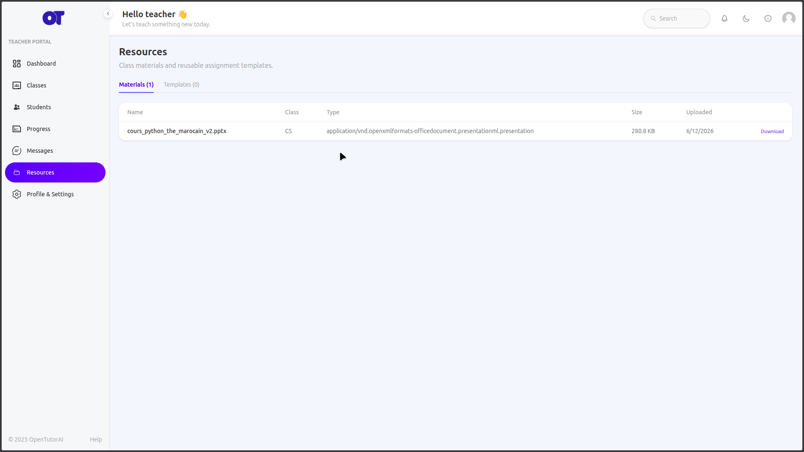

### Control — screens & live presence (during class)

1. Open the **Control** tab. The **`X/Y online now`** indicator is always shown; click it to see
   every student with a 🟢 online / 🔴 offline dot. It refreshes by itself every few seconds.
2. Click **Lock** on a student (or **Lock all**) to blank their TutorAI screen; **Unlock** to
   restore it.
3. **The lock sticks.** It is remembered for each student, so a student who was offline when you
   locked them — or who simply reloads the page — comes back **already locked**. You don't have to
   re-lock them; the screen restores only when you click Unlock.
4. **Tab-away accountability.** While a student is locked, if they switch tab, minimise, or click
   away, you immediately see a **👀 Away** marker next to their name, and every leave/return is
   written to the **Screen activity** log on the same tab — so you can review what happened even
   if you weren't watching at that moment. Use the **Clear** button to reset the log.
5. _Honest limit:_ locking blanks the page instantly, but forcing true full-screen depends on the
   student's browser and may only engage on their next click. This is **accountability, not an
   OS-level lockdown** — a determined student on their own device can still leave; you'll just see
   it logged.

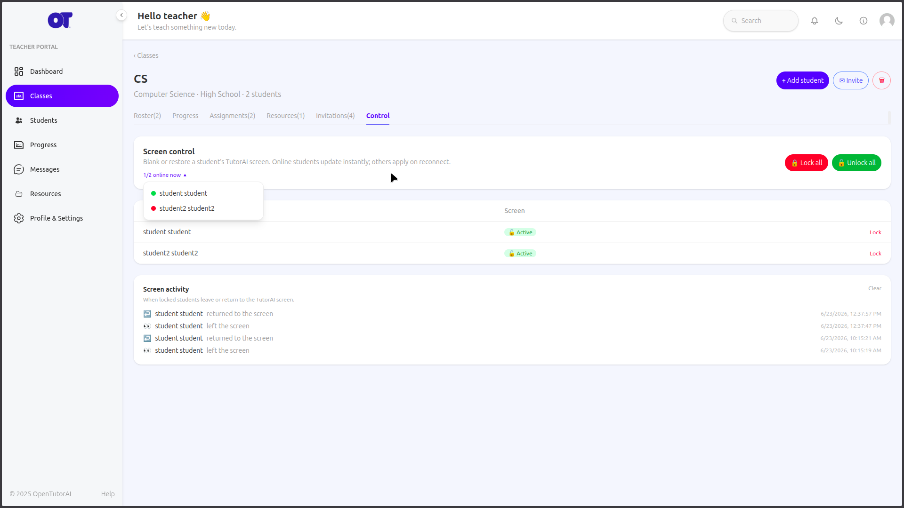
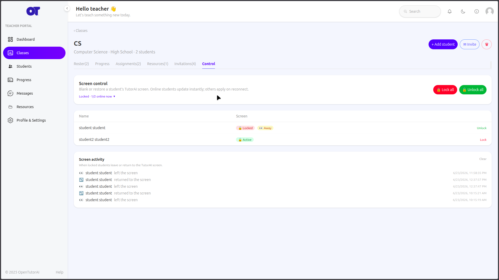

### Messages

Open **Messages** to start a 1:1 conversation with a student in your class. Unread messages show a
badge, and new messages arrive live.

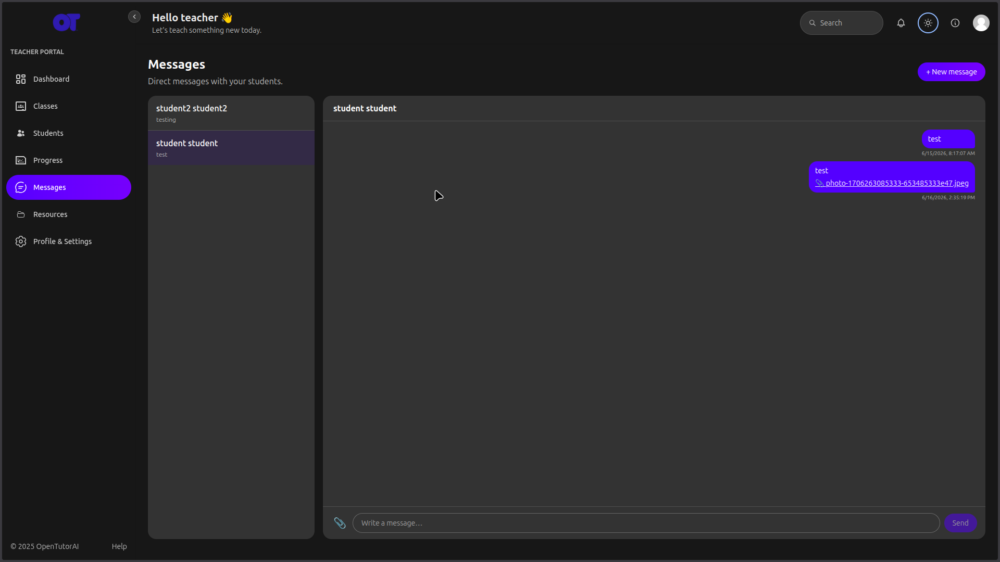

---

## 3. For students

1. **Assignments** in the sidebar lists your work across all your classes, grouped into
   **To Do / Submitted / Graded / Late / Missed**.
2. Open an assignment to read it and download any teacher attachment.
3. Write your answer and/or attach a file, then **Submit**. After the teacher grades it, reload to
   see your score and feedback.
4. **Exams** open in a full-screen shell with a countdown timer. Leaving the screen triggers
   warnings; when time runs out your work is submitted automatically.
5. During class your teacher may **lock** your screen — it will be covered with a clear message
   until they unlock it.

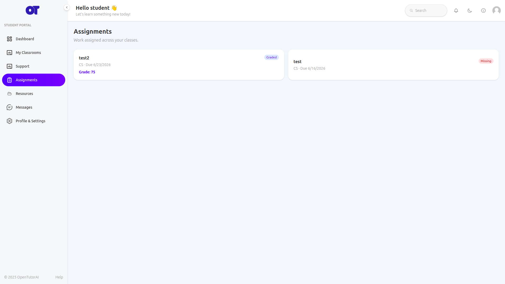
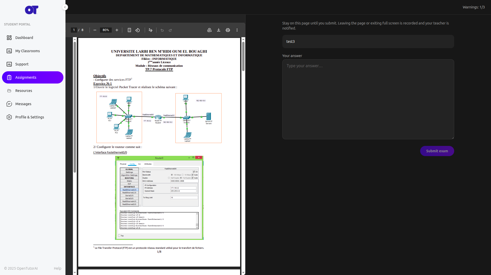
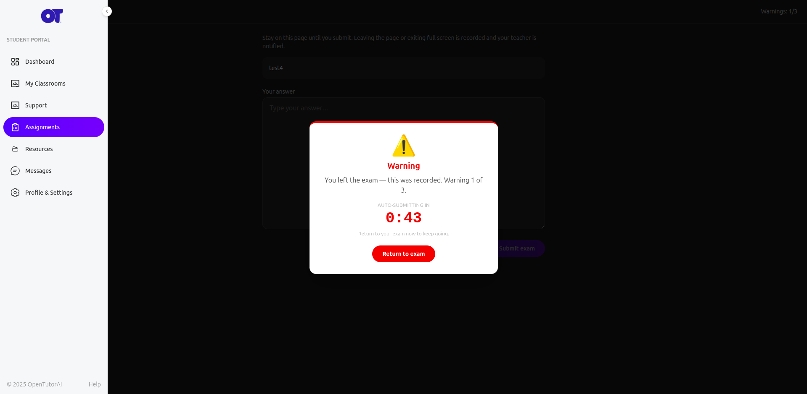
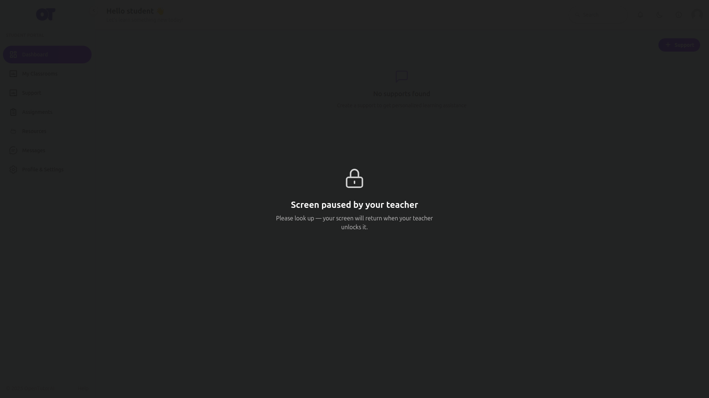

---

## 4. For parents (guardians)

A teacher can **invite** you and link you to your child as a **guardian**. Once you accept, the
teacher can see the link and contact you (at minimum by email). Parent dashboards are not part of
this release — for now the guardian link lets the teacher reach you.

---

## 5. Safety notes

- You only ever see your own classes and the people in them; access to anyone else's data is
  refused.
- Uploaded files are checked for type and size.
- Screen control affects the _device/session_ only — it never alters a student's learning records.
