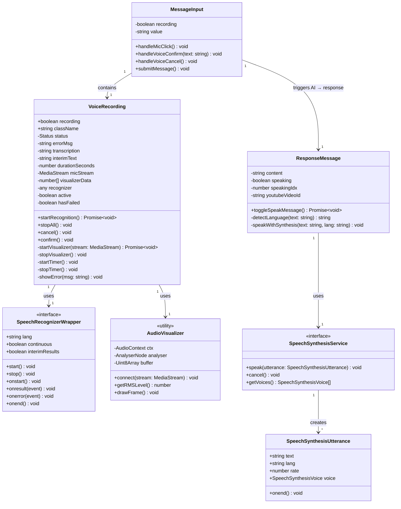
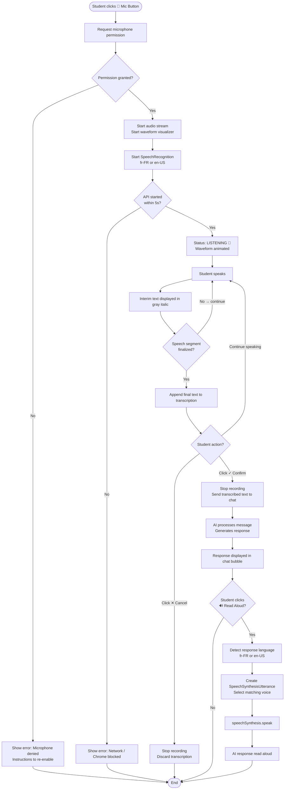
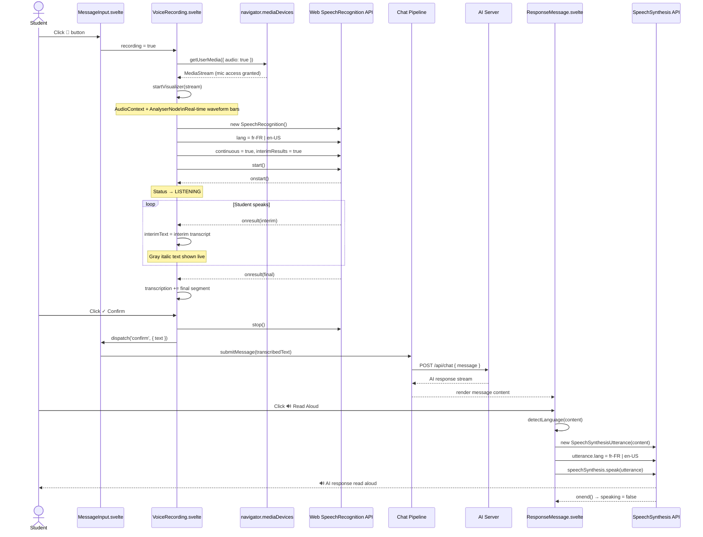
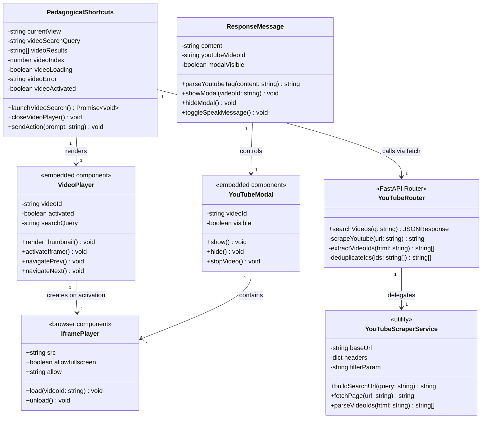
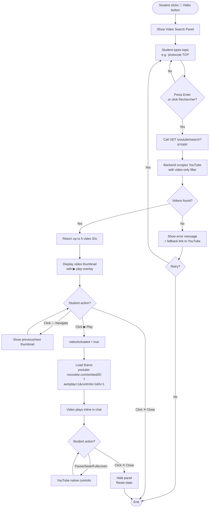
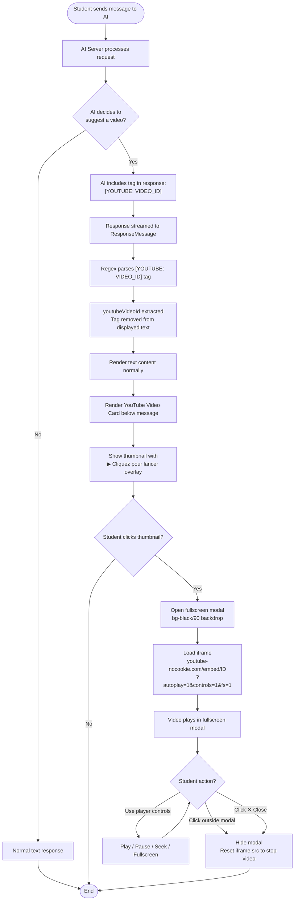
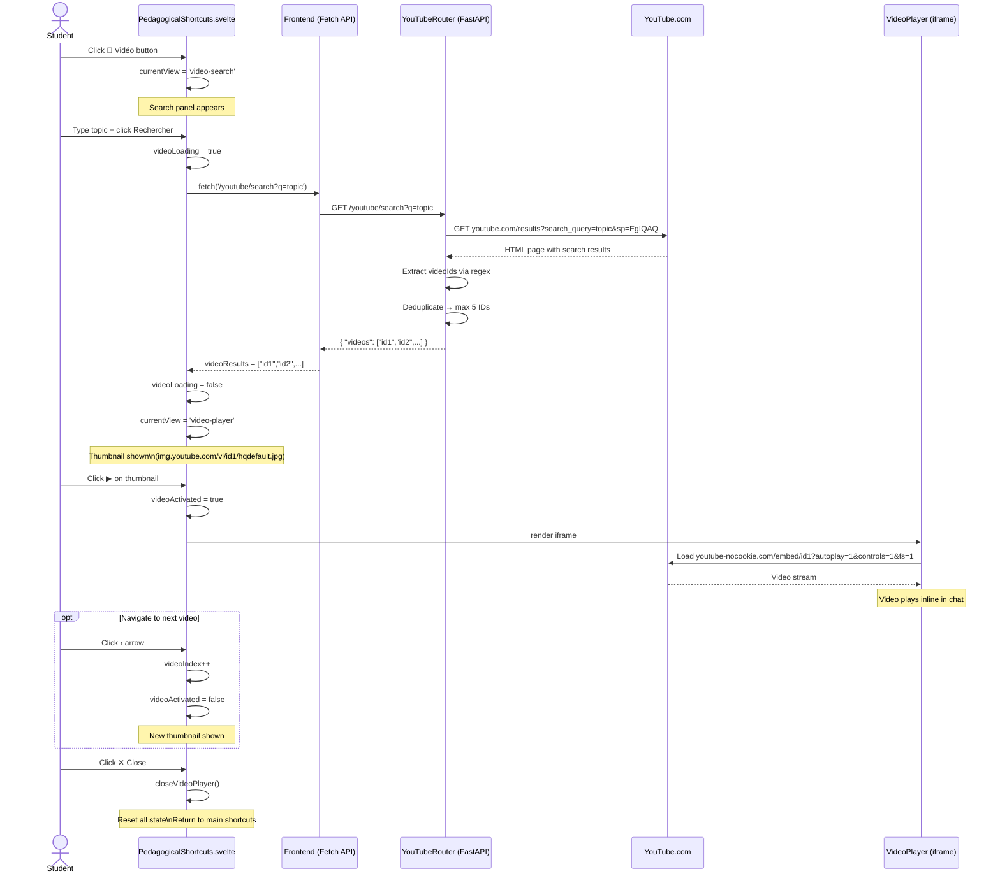
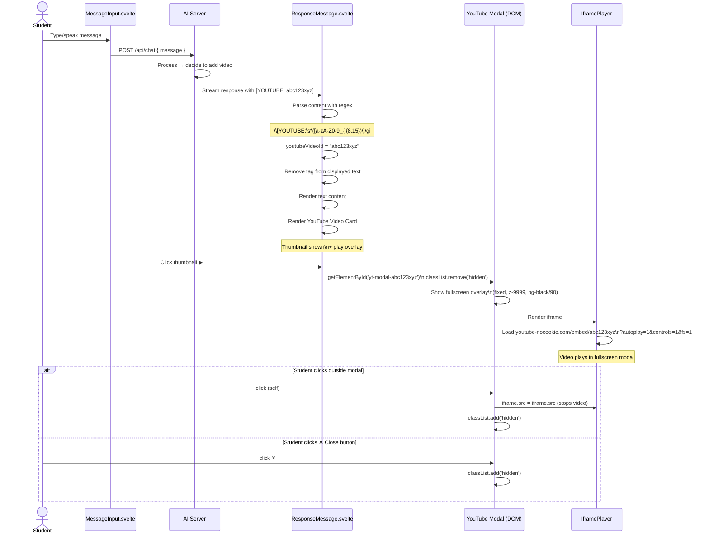

# UML Diagrams — OpenTutorAI Sprint Features

---

# USER STORY 1 — Voice Interaction with AI

---

## 1.1 Class Diagram — US1

---

## 1.2 Activity Diagram — US1

---

## 1.3 Sequence Diagram — US1

---
---

# USER STORY 2 — Integrated Explanatory Video in Chat

---

## 2.1 Class Diagram — US2

---

## 2.2 Activity Diagram — US2 (Pedagogical Shortcuts path)

---

## 2.3 Activity Diagram — US2 (AI Response path)

---

## 2.4 Sequence Diagram — US2 (Pedagogical Shortcuts path)

---

## 2.5 Sequence Diagram — US2 (AI Response path)

